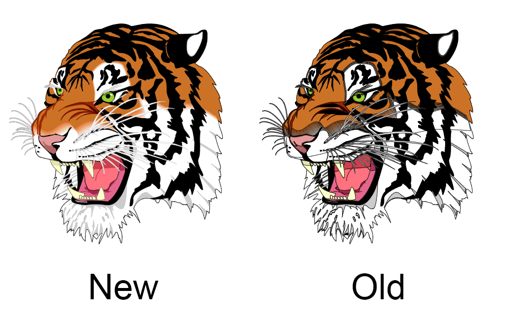

# OrbGL

The Orbital Graphics Library is a library for rendering 2D and 3D graphics.

[](https://gitlab.redox-os.org/redox-os/orbgl/pipelines)
[](./LICENSE)

### Screenshot



### Workspace overview

* orbgl: main crate compatible with Redox, Linux, macOS and Window
* orbgl_api: base API
* orbgl_shapes: optinal extion with drawable shapes 
* orbgl_web: web version of OrbGL and is compatible with stdweb.

### Goal
The first goal is to be compatible with HTML Canvas.

### Tasks

##### Colors, Styles, and Shadows
- [x] set_fill_style()  ```Only with a color at the moment```
- [x] set_stroke_style()    ```Only with a color at the moment```
- [ ] set_shadow_color()
- [ ] set_shadow_blur()
- [ ] set_shadow_offset_x()
- [ ] set_shadow_offset_y()
- [ ] create_linear_gradient()
- [ ] create_pattern()
- [ ] create_radial_gradient()
- [ ] add_color_stop()

##### Line Styles
- [ ] set_line_cap()
- [ ] set_line_join()
- [ ] set_line_width()
- [ ] set_miter_limit()

##### Transformation
- [x] scale()
- [x] rotate()
- [x] translate()
- [x] transform()
- [x] set_transform()

##### Paths
- [x] fill()
- [x] stroke()
- [x] begin_path()
- [x] move_to()
- [x] close_path()
- [x] line_to()
- [ ] clip()
- [x] quadratic_curve_to()
- [x] bezier_curve_to()
- [ ] arc()
- [ ] arc_to()
- [ ] is_point_in_path()

##### Text
- [ ] set_font()
- [ ] set_text_align()
- [ ] set_text_baseline()
- [ ] fill_text()
- [ ] stroke_text()
- [ ] measure_text()

##### Rectangles
- [x] rect()
- [x] fill_rect()
- [x] stroke_rect()
- [x] clear_rect()

##### Image
- [ ] draw_image()

##### Other
- [x] save()
- [x] restore()
